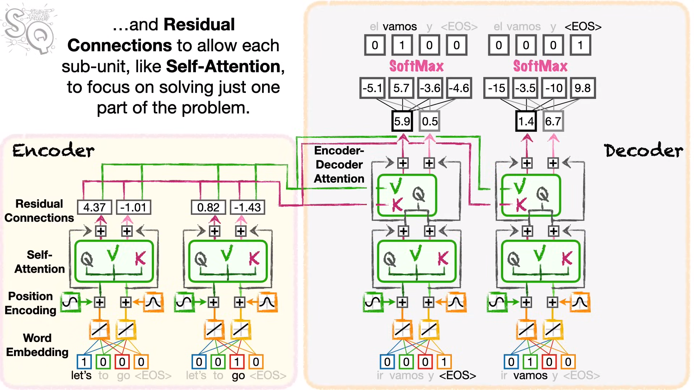
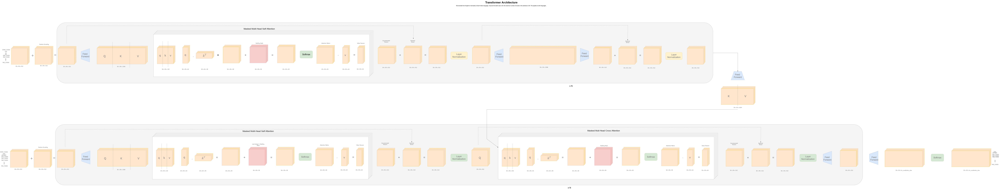

## Transformer Cheat Sheet

#### Additional Resources:

- 📑 [Notion Document with Further Details](https://www.notion.so/uttam-patel/Transformer-98a0f35922024b19896403ed85dc76a1)
- 🎥 [Video Tutorial on Transformers](https://www.youtube.com/watch?v=zxQyTK8quyY&t=1890s)

#### Transformer Architecture:

1. **Self-Attention Mechanism:**
   - 🔑 Key to transformer's success.
   - 🔄 Allows the model to weigh input tokens differently when making predictions for a given token.

2. **Multi-Head Attention:**
   - ➡️ Multiple attention heads run in parallel.
   - 🎯 Enables the model to focus on different aspects of the input sequence.

3. **Positional Encoding:**
   - 📍 Addresses the lack of sequential information in self-attention.
   - ➕ Adds positional information to input embeddings.

4. **Feedforward Neural Network:**
   - ➡️ Applies a linear transformation followed by a non-linear activation function (commonly ReLU).

5. **Layer Normalization:**
   - 📊 Normalizes inputs across the feature dimension.

6. **Encoder and Decoder Stacks:**
   - 🔗 Stacks of identical layers for both encoder and decoder.

-----

#### Training:

1. **Loss Function:**
   - 📉 Typically cross-entropy loss for classification tasks.
   - 📊 Mean squared error for regression tasks.

2. **Optimization:**
   - 🚀 Adam optimizer is commonly used.
   - 📈 Learning rate scheduling is crucial for stable training.

#### Model Parameters:

1. **Embedding Dimension:**
   - 📏 Determines the dimensionality of input and output embeddings.

2. **Number of Encoder and Decoder Layers:**
   - 🔢 The depth of the model, usually in the range of 6 to 12 layers.

3. **Number of Attention Heads:**
   - 🔍 Determines the number of parallel attention mechanisms in multi-head attention.

4. **Dropout:**
   - ❌ Regularization technique to prevent overfitting.
   - 🔄 Applied to the output of each sub-layer.

#### Inference:

1. **Greedy Decoding:**
   - 🚶‍♂️ Selects the token with the highest probability at each step.

2. **Beam Search:**
   - 🛤️ Expands the search space by considering multiple candidates at each step.

3. **Temperature Scaling:**
   - 🌡️ Adjusts the softmax temperature during sampling for controlling the diversity of generated sequences.

#### Applications:

1. **Natural Language Processing (NLP):**
   - 📰 Sentiment analysis, text summarization, machine translation.

2. **Image Generation:**
   - 🖼️ Transformer models adapted for image generation tasks.

3. **Speech Recognition:**
   - 🗣️ Transformers applied to convert spoken language into text.

#### Common Libraries:

1. **Transformers Library:**
   - 🤗 Hugging Face's Transformers library is widely used for pre-trained models and convenient APIs.

2. **TensorFlow, PyTorch:**
   - 🧠 Popular deep learning frameworks for implementing and training transformer models.

#### Tips for Efficient Training:

1. **Batching:**
   - 🍲 Use batch processing for faster training.
   - 🚧 Padding and masking are crucial for handling variable-length sequences.

2. **Mixed Precision Training:**
   - ⚖️ Utilize half-precision (float16) for faster training without sacrificing much precision.

3. **Model Parallelism:**
   - 🔄 Distribute the model across multiple GPUs or devices for handling large models.

#### Popular Models:

1. **BERT (Bidirectional Encoder Representations from Transformers):**
   - 🤖 Pre-trained on massive datasets for various NLP tasks.

2. **GPT (Generative Pre-trained Transformer):**
   - 🗣️ Known for generating coherent and contextually relevant text.

3. **T5 (Text-To-Text Transfer Transformer):**
   - 🔄 Treats all NLP tasks as a text-to-text problem.

